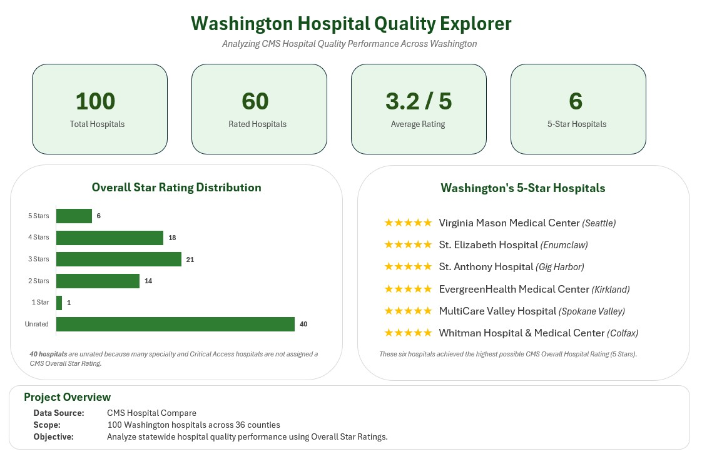
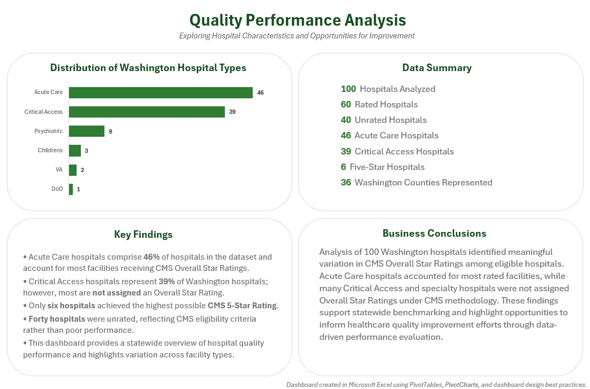

# Washington Hospital Quality Explorer

### Analyzing CMS Hospital Quality Performance Across Washington Using Microsoft Excel


---

## Project Overview

Healthcare quality data provides valuable opportunities for benchmarking hospital performance and identifying statewide trends, but large public datasets can be difficult to interpret without effective visualization.

This project transforms publicly available CMS Hospital Compare data into an executive-style Excel dashboard that summarizes hospital quality performance across Washington State. Using PivotTables, PivotCharts, KPI development, and dashboard design best practices, the analysis communicates complex healthcare quality metrics through clear, business-focused visualizations.

---

## Business Problem

Healthcare leaders need reliable ways to compare hospital quality performance across the state to identify trends and support quality improvement initiatives.

Although CMS publishes extensive hospital quality data, the information is large, complex, and not immediately actionable without meaningful analysis and visualization.

---

## Business Question

> **How does hospital quality performance vary among Washington hospitals, and what opportunities exist to support healthcare quality improvement?**

---

# Project at a Glance

| Metric | Value |
|---------|------:|
| Hospitals Analyzed | **100** |
| Rated Hospitals | **60** |
| Unrated Hospitals | **40** |
| Counties Represented | **36** |
| Average Overall Rating | **3.2 / 5** |
| Five-Star Hospitals | **6** |

---

## Dataset

**Source:** CMS Hospital Compare

**Geographic Scope:** Washington State

The dataset includes:

- Hospital Overall Star Rating
- Hospital Type
- Mortality Measures
- Safety Measures
- Readmission Measures
- County
- Emergency Services

---

## Tools Used

| Tool | Purpose |
|------|---------|
| Microsoft Excel | Data analysis and dashboard development |
| PivotTables | Data summarization |
| PivotCharts | Data visualization |
| Dashboard Design | Executive reporting |
| KPI Development | Performance monitoring |

---

# Analytical Process

1. Filtered CMS Hospital Compare data to Washington hospitals.
2. Explored hospital characteristics using PivotTables.
3. Calculated summary metrics and KPIs.
4. Designed executive dashboards to communicate findings.
5. Developed business conclusions from statewide quality trends.

---

# Dashboard Preview

## Executive Overview

<p align="center">
  
</p>

Highlights include:

- Total hospitals analyzed
- Rated hospitals
- Average Overall Star Rating
- Five-Star hospitals
- Overall Star Rating distribution
- Washington's Five-Star hospitals

---

## Performance Analysis

<p align="center">
  
</p>

Supporting analysis includes:

- Hospital type distribution
- Data summary
- Key findings
- Business conclusions

---

# Key Findings

- Acute Care Hospitals represented **46%** of facilities analyzed and accounted for most hospitals receiving CMS Overall Star Ratings.
- Critical Access Hospitals represented **39%** of Washington hospitals; however, many were **not assigned Overall Star Ratings** because of CMS eligibility methodology.
- Only **six hospitals** achieved the highest possible **5-Star Overall Hospital Rating**.
- **Forty hospitals** were unrated, emphasizing the importance of understanding CMS rating methodology before comparing facilities.
- Executive dashboards improve interpretation of complex public healthcare data by presenting actionable insights in a concise, stakeholder-friendly format.

---

# Business Conclusions

The analysis identified meaningful variation in hospital characteristics and CMS Overall Star Ratings across Washington hospitals.

Results highlight the importance of considering hospital type and CMS rating eligibility when benchmarking hospital performance. By transforming complex public healthcare data into executive dashboards, this project demonstrates how thoughtful data visualization can support informed evaluation of statewide healthcare quality and facilitate data-driven decision making.

---

# Repository Structure

```text
washington_hospital_quality_explorer/
│
├── data/
│
├── dashboard/
│   └── washington_hospital_quality_explorer.xlsx
│
├── images/
│   ├── analysis.jpg
│   ├── executive_overview.jpg
│   ├── executive_overview_cropped.jpg
│   ├── metrics.jpg
│   ├── performance_analysis.jpg
│   └── performance_analysis_cropped.jpg
│
├── presentation/
│   ├── washington_wospital_quality_explorer_ppt.pptx
│   └── washington_wospital_quality_explorer_pdf.pdf
│
└── README.md
```

---

# Skills Demonstrated

- Executive Dashboard Design
- KPI Development
- PivotTables
- PivotCharts
- Data Visualization
- Healthcare Analytics
- Business Analysis
- Executive Reporting
- Data Storytelling

---

# Author

**Jen Fordham, RHIA**

Healthcare Data Integrity Analyst

SQL • Python • Excel • Power BI • Healthcare Analytics

---

*Transforming complex healthcare data into clear, actionable insights through effective data visualization.*